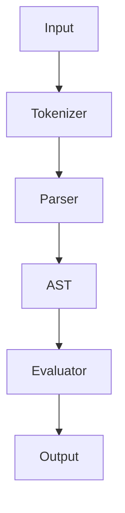

Tokenizer
	- Simple idea to turn simple text into meaningful pieces

		Loop through the strings and evaluate if it should be considered, invalid syntex should throw a stdexcept

Parser
	- This is the main architectural choice, since one of the goals involves graphing the choice was to go for Recursive Descent
			It will build an AST (data structure used to represent the structure of a program or code spinnet), so adding new features will the same as adding a new node

Evaluator
	- Basic idea revolves around walking the tree and computing the result

Output
	- End goal of any calculator is showing the results

